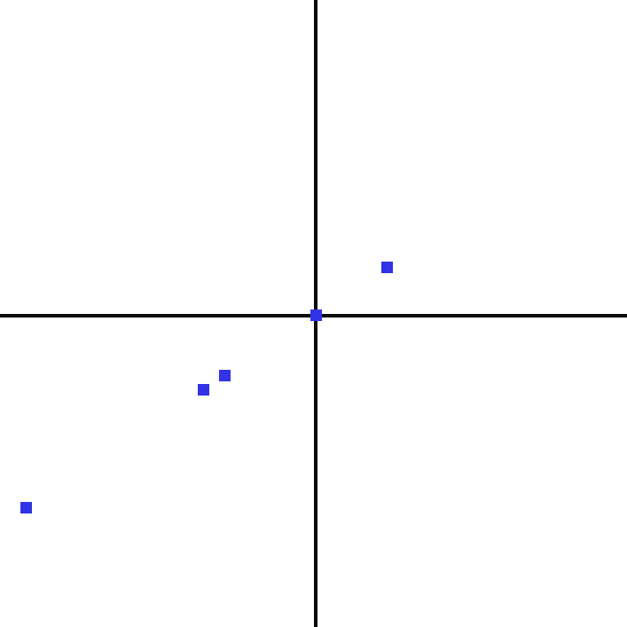

# Picolo
Image-reading crate for plotting data and transposing image contents into a data structure with the precision decided by the user.



# Basic plot

```rust

// Plotting a 2d Vector
// @Params: x: &u32, y: &u32
use picolo::plot::plot;
fn main() {
    let x = vec![0, 152, 1000];
    let y = vec![0, 152, 490];
    plot(&x, &y);
}
```

# Setting up image transpose

```rust

// Easiest way to print half the contents
let pixl_struct = load_picture("images/icon.png", 2);

for i in pixl_struct {
     println!("{:?}", i); 
}

// Accessing all fields:
// @Params: &path as &str, precision as u32 (1 = 100% precision, 2 = 50%, ...)  
use picolo::readimg::load_picture;

let foo = "images/icon.png"; 
let bar_str = &foo;
let precision = 1;
let pixl_struct = picolo::load_picture(bar_str, precision);

// Print all the contents derived from image
for i in pixl_struct {
    println!("x {} y {} red {} green {} blue: {}", i[0].x, i[0].y, 
    i[0].color.red, i[0].color.green, i[0].color.blue);
}

```

#TODO:
*Convert to uf32 functionality (Floats are just easier to work with)
* Add option to draw circles if preferred (.json file preferably)
* Add coloring variation if dataset become too large for the plot
* Add line drawing
* Add function to open image after the plot has been drawn so the user doesn't have to
* Refactor current way of finding origin with more exact positions
